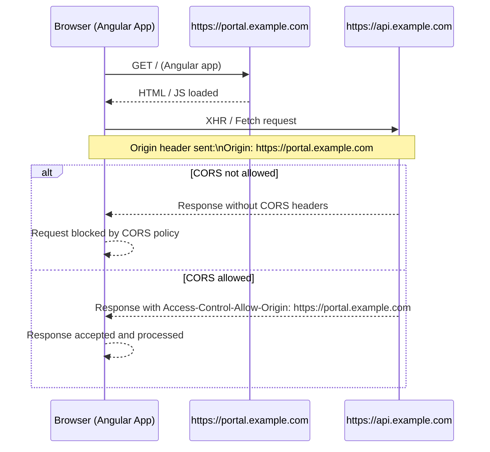

# Architecture

## How can traefik be the backbone to your production infrastructure.

The diagram illustrates a web application architecture:

1. All users use a web browser like Chrome or Firefox to interact with the solution.
1. Browser connects to the edge load balancer(s)
1. Edge load balancer connects to Traefik application edge proxy.

### Advantages and Design goals

1. In development and test stages, the setup is identical to production - except for the edge load balancers.

1. TLS is used on every connection into and also within the architecture components.

1. Backend containers may connect each other via a load balanced route.

1. Configuration of endpoints is independent from the stage.

1. Images are portable across all environments.

1. Backend containers can be scaled transparently.

### How to achieve these goals

1. Backend containers are discovered as upstreams automatically by Traefik with its Docker provider listening on the Docker socket.

1. CORS headers are not necessary when no cross site domains are in use.

#### How CORS works

CORS is strict, deterministic, and enforced by the browser. There is no flexibility or inference based on “same company” or DNS hierarchy.
- portal.example.com → api.example.com are different origins.
- Origin = scheme + host + port. Subdomains do not collapse.

Implication for Angular:
- Angular code loaded from https://portal.example.com
- Calling https://api.example.com
- Browser sends Origin: https://portal.example.com
- API must explicitly allow this origin via CORS headers.


#### Traefik as gateway

```mermaid
flowchart TB
    Client[Client / Browser]

    ELB[AWS Edge Load Balancer<br/>443 / TLS]

    Traefik[Traefik Edge Proxy<br/>TLS Termination<br/>Port 443]

    subgraph Frontend
        Angular[Angular Container<br/>Static Assets<br/>UI / CSS / Images / Fonts<br/>TLS 443]
    end

    subgraph Backend
        Java1[Java Container A<br/>API / Services<br/>TLS 443]
        Java2[Java Container B<br/>API / Services<br/>TLS 443]
    end

    EdgeCert[Edge TLS]
    UpstreamCert[Upstream TLS]

    Client -->|HTTPS 443| ELB
    ELB -->|HTTPS 443| Traefik

    Traefik -->|HTTPS 443| Angular
    Traefik -->|HTTPS 443| Java1
    Traefik -->|HTTPS 443| Java2

    Java1 -->|HTTPS 443 via Traefik| Traefik
    Java2 -->|HTTPS 443 via Traefik| Traefik

    Traefik --- EdgeCert
    Traefik --- UpstreamCert
    Angular --- UpstreamCert
    Java1 --- UpstreamCert
    Java2 --- UpstreamCert
````